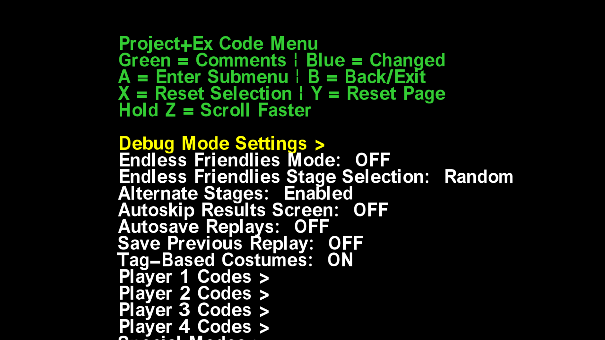

# Code Menu

The [code menu](https://github.com/QuickLava/PowerPC-Assembly-Functions) is a modded system that adds a new debug menu to the game. Usually accessible with `L+R+D-pad Down` or from the main menu, the code menu allows you to toggle various debug parameters.

Modern versions of the code menu include a **code menu builder**, or multiple builders. These are .exe files (usually named something like **Code Menu Builder.exe** or **PowerPC-Assembly-Functions.exe**) that you can run to build the code menu, which generates the necessary files to be placed in the build. Usually, these versions of the code menu also include an **EX_Config.xml** in the same location as the builder, which you can modify to tweak various settings for your code menu before running the builder. The first run of the builder also usually creates a **Code_Menu_Options.xml** file (or **Net-Code_Menu_Options.xml** for the netplay builder) which you can use to toggle default options for your code menu before rebuilding it.

The code menu consists of a few different components:
- **data.cmnu** or **dnet.cmnu** are the raw data of the code menu and the netplay code menu, respectively. Typically located in `pf/menu3`.
- **CodeMenu.asm** or **Net-CodeMenu.asm** are the actual code for the menu and the netplay menu, respectively. Typically located in `Source/Project+` or `Source/Netplay` respectively.

Changes to the code menu require [recompiling your codeset](codes?id=compiling-codes).

---

## Resources

#### Code Menu Resources

- [Code Menu](https://github.com/QuickLava/PowerPC-Assembly-Functions) by QuickLava - The actual source and releases page for the modern code menu by QuickLava, forked from DesiacX's original code.

#### Code Menu Guides

- [Code Menu Wiki](https://github.com/QuickLava/PowerPC-Assembly-Functions/wiki) - The wiki for the code menu, which has various resources and guides on how to work with the code menu.