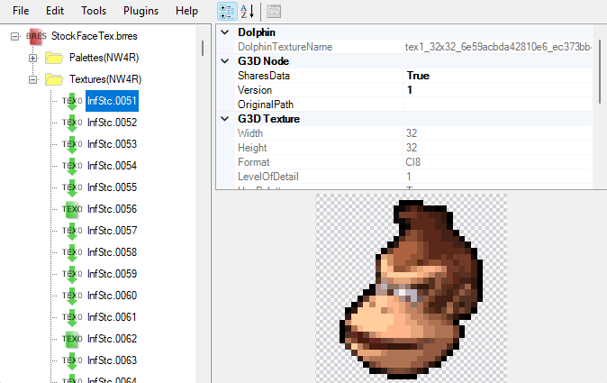
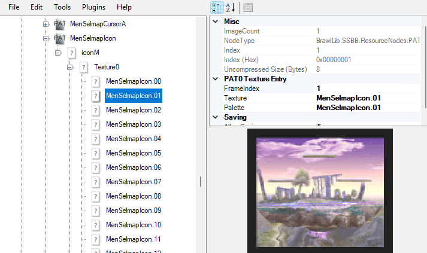
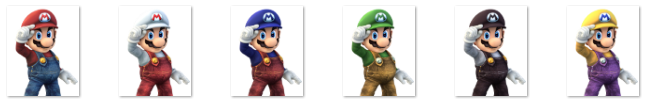
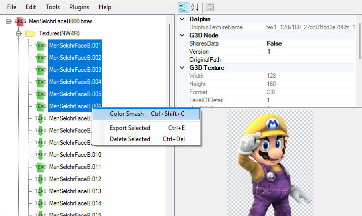
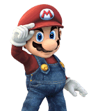
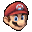

# Cosmetics

Many UI elements, especially those associated with fighters or stages, are referred to as **cosmetics**. This is a broad term that largely refers to a UI element that is tied to something which could be expanded on - for instance, fighters, stages, or trophies, adding more of those things necessitates new UI elements such as portraits, previews, or thumbnails.

Cosmetics are used all throughout the game, scattered throughout many different files, and those locations can differ depending on your build, so it is difficult to give a comprehensive detailing of every cosmetic location and requirement. Instead, this section will serve as a broad overview of the general rules around cosmetics and what types of cosmetics you may want to be familiar with.

## Conventions

Within Brawl, cosmetics follow a pretty standardized set of conventions in how they are named and accessed by different parts of the game. 

### Textures and Models

Most cosmetics exist as **textures** in a build, usually located within a BRRES archive. Often, the name of the texture follows a standardized format that helps the game access it consistently (see below), but sometimes an animation is used to locate the cosmetic instead.

Some cosmetics are actually **models**. These aren't much different than textures - they usually follow a lot of the same patterns textures do - but they are 3D models instead of a 2D image.

#### Prefix

The name of a texture associated with a cosmetic usually begins with a **prefix** that is consistent for that type of cosmetic. For instance, in Brawl, the stock icons used in rotation mode always begin with a prefix of `InfStc`.

#### Cosmetic ID

Generally, any given type of cosmetic has an **ID** it is associated with which is used for the game to locate that cosmetic when the ID associated is accessed in some way. For example, every fighter has a cosmetic ID which is used by the game to locate that fighter's UI elements. Link's is 2, so all of his cosmetics have an ID that is equal to or multiplied by 2.

In texture names, the cosmetic ID (or some modification of it) follows the prefix used at the start of the texture name. For example, Link's stock icon in vanilla Brawl is named `InfStc.021`, with the `02` being his cosmetic ID.

Many modern builds use a system called 50CC (short for "Fifty-Costume Code"), which allows characters to have up to 50 costumes. With this system, the ID is often multiplied by 50 when calculating texture names. For example, Link's costume ID would actually be considered `100` in the above example in a 50CC build, making the name of the texture `InfStc.0101` instead.

#### Costume Index

Cosmetics associated with fighters can sometimes have a costume index, indicating they are tied to a specific fighter. In fact, most costumes tied to fighters use a costume index, even if they are not tied to a specific costume. In these cases, it is usually just `1`.

The costume index usually follows the cosmetic ID. For example, in Link's cosmetic `InfStc.021`, the `1` is the costume index as it is tied to Link's first costume.

### Texture Animations

While texture names are one way cosmetics are accessed, sometimes cosmetics are accessed via a **texture pattern animation**, or a PAT0 animation. In this case, the cosmetic is usually accessed by pointing to the **FrameIndex** of the animation that matches the cosmetic ID.

_In this example, Battlefield has a cosmetic ID of 1, so the Battlefield icon is accessed by a PAT0 animation at FrameIndex 1._

## Color Smashing

Textures used for cosmetics take up space. Having too many textures can cause errors or even crashes. To ensure cosmetics take up minimal space, you should use **color smashing**.

Color smashing is the act of taking multiple images and merging some of their data. In this way, their pixel data is shared while their palette data is different. This minimizes the space they take up.

Color smashing is only really effective if the images being color smashed are similar. As such, it is best to use it for images that are generally the same, just with different colors. The most common use-case is using it for the cosmetics associated with recolors - for example, color smashing all of Mario's basic "plumber" outfits. You wouldn't want to color smash a plumber Mario outfit with a Dr. Mario one.

_All of these images have the same model and pose, but different colors, so they should be color smashed._

To color smash textures, simply highlight (shift+click) all of the textures (in sequential order) that you wish to color smash, then right-click the last selected texture and select "Color Smash". BrawlInstaller can also automatically color smash textures when installed.

## Types of Cosmetics

This is a list of common cosmetic types you might find in builds. It is not meant to be comprehensive, but to be a good source for understanding terminology used in the modding community when discussing cosmetics.

### CSPs

**CSP** stands for **character-select portrait**. CSPs are the portraits that display on the character select screen. They are usually 128 x 160 pixels.

Similar portraits are displayed on the results screen. These are usually referred to as **RSPs**, or **results-screen portraits**.

### Stock Icons

**Stock icons** refer to the small icons of a character's head that display in some parts of the game. In most modern builds, these icons dislpay in battle to represent your individual stocks. In vanilla Brawl, they are displayed on the results screen to show who you KO'ed and who KO'ed you. They are also used in various other places. They are usually 32 x 32 pixels.

### BPs

**BP** stands for **battle portrait**. BPs are the smaller portraits that display for each port during a match. They are usually 48 x 56 pixels.

### CSS Icons

**CSS icons** are the small icons that display on the CSS (character-select screen) where you place your coins to select a character. They are also used in other players like Subspace Emissary. They differ in size between builds.

---

# Resources

#### Cosmetic Resources

- [Cosmetic Templates](https://www.mediafire.com/file/rw9h1c0s5ecikan/Cosmetic_Templates.zip/file) - An archive of various templates used for creating different types of fighter cosmetics.

#### Cosmetic Guides

- [BrawlEx Guide for P+Ex](https://docs.google.com/document/d/1ZoL_qDcwUpUXg82cKaUp-6D_AcfpFctoW6GXFY74_0k/edit?usp=sharing) by KingJigglypuff, originally by Robintjuh - A general-purpose guide for installing BrawlEx characters to P+Ex builds, but goes into extensive detail on setting up various fighter cosmetics.
- [Project+ stage managing guide](https://docs.google.com/document/d/19TnQceFG2_9NQJ1Dyz3JCWLVBrKePcgBoiDW0pgW8qA/edit?tab=t.0) by mawwwk - A general-purpose guide on setting up stage slots, but goes into extensive detail on stage cosmetics in Project+ builds.