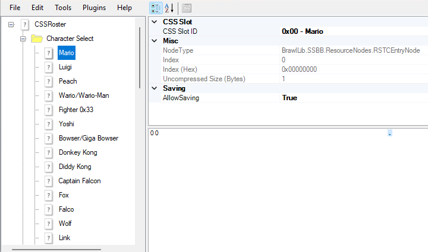

# EX Configs

!> This section is only applicable if you're using a BrawlEx build

**EX Configs** are configuration files used by BrawlEx to map fighters to IDs and properties so the game knows which characters to load and what to do with them. Every fighter, in theory, should have 4 configs - each of a different type - although some of the values of these configs are hardcoded into BrawlEx, so vanilla fighters can sometimes be missing some and still function correctly. When adding a new fighter, you'll need to make sure they have these configs as well.

There are 4 types of configs:
- FighterConfig
- CosmeticConfig
- SlotConfig
- CSSSlotConfig

Each of these configs has their own ID associated. Most EX fighters use one ID, which is shared across all of their configs, but some fighters use different IDs for each config.

Configs are usually located in `pf/BrawlEx` in a subfolder matching the cosmetic type listed above. However, in some newer builds they are located in an `ExConfigs.pac` at the same location, within an ARC node with a name matching the cosmetic type listed above.

## CosmeticConfig

The **CosmeticConfig** sets up various cosmetic components of the fighter, including the the character's display name on various screens, their [cosmetic ID](cosmetics?id=conventions), franchise icon ID, and announcer call ID.

CosmeticConfigs are stored in `pf/BrawlEx/CosmeticConfig` and are named `CosmeticXX.dat`, where `XX` is the cosmetic config ID of the fighter. In some builds it is stored in `pf/BrawlEx/ExConfigs.pac` under the `CosmeticConfig` ARC node, with a `FileIndex` equal to the cosmetic config ID.

## CSSSlotConfig

The **CSSSlotConfig** sets up Wiimote SFX and the costumes associated with the fighter.

CSSSlotConfigs are stored in `pf/BrawlEx/CSSSlotConfig` and are named `CSSSlotXX.dat`, where `XX` is the CSS slot config ID of the fighter. In some builds it is stored in `pf/BrawlEx/ExConfigs.pac` under the `CSSSlotConfig` ARC node, with a `FileIndex` equal to the CSS slot config ID.

## FighterConfig

The **FighterConfig** sets up many details of the fighter, most importantly which files are loaded for that fighter.

FighterConfigs are stored in `pf/BrawlEx/FighterConfig` and are named `FighterXX.dat`, where `XX` is the fighter config ID of the fighter. In some builds it is stored in `pf/BrawlEx/ExConfigs.pac` under the `FighterConfig` ARC node, with a `FileIndex` equal to the fighter config ID.

## SlotConfig

The **SlotConfig** is used mainly to set up the character's victory theme and announcer call.

SlotConfigs are stored in `pf/BrawlEx/SlotConfig` and are named `SlotXX.dat`, where `XX` is the slot config ID of the fighter. In some builds it is stored in `pf/BrawlEx/ExConfigs.pac` under the `SlotConfig` ARC node, with a `FileIndex` equal to the slot config ID.

## Roster File

In order for your character to actually display on the CSS, you also need to modify a roster file that controls who displays. In most builds, this is located in `pf/BrawlEx` and is named something like `CSSRoster.dat` or `css.bx`.

The roster file usually contains two folders in it - **Character Select** and **Random Character Select**. The former controls which characters actually appear on the CSS, while the latter controls which characters are available when you select random. If you want a character available in either roster, you simply need to right-click the respective folder and select "Add New Entry". Then, highlight the new entry and change it's "CSS Slot ID" to match the fighter you are trying to add.

# Resources

#### EX Config Guides

- [BrawlEx Guide for P+Ex](https://docs.google.com/document/d/1ZoL_qDcwUpUXg82cKaUp-6D_AcfpFctoW6GXFY74_0k/edit?usp=sharing) by KingJigglypuff, originally by Robintjuh - A general-purpose guide for installing BrawlEx characters to P+Ex builds, but goes into great detail about configuring EX configs and the roster.

#### EX Config Resources

- [P+Ex Config Templates](https://drive.google.com/file/d/19rv-2aUKViQu9autyLLmJA-JLQ-hPgII/view?usp=sharing) - EX configs for the entire P+Ex cast which can be copied and edited to use as a base for new characters.
- [BrawlEx Clone Engine v2.0.0.0](https://www.dropbox.com/scl/fi/cfhky1qei05tgh2i9h9e4/BrawlEx-Clone-Engine-v2.0.0.0.zip?rlkey=19j941xh8voem46x712q5vaoh&e=1&dl=0) - The original BrawlEx archive, containing vBrawl EX configs for the vanilla cast.
- [ProjectM + BrawlEx Resources](https://www.mediafire.com/file/5funzwc4prer6fe/ProjectM%252BBrawlEx_Resources.zip/file) - An archive of the EX configs and EX modules for Project M + BrawlEx.