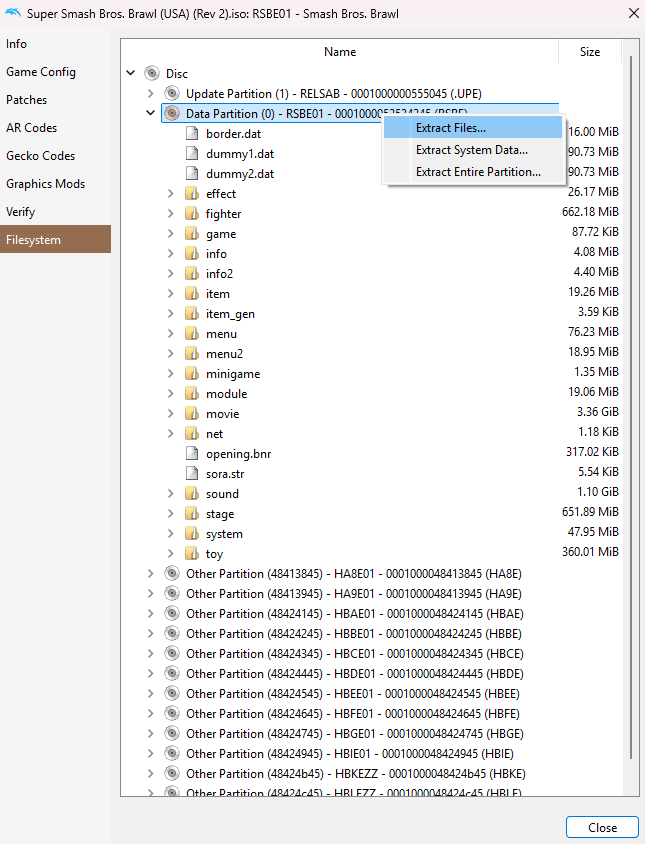

# Extracting Brawl Files

When modding the game, it can be useful to have access to all of the files from the original game. Fortunately, you can do this with Dolphin.

First, make sure you have [Dolphin](https://dolphin-emu.org/) and a legally-ripped Brawl ISO. Then, make sure to add Brawl to the list of games available in Dolphin.

Once you have Dolphin configured with Brawl, you can right-click the game and select "Properties". A window with the game properties will appear. On the left-hand side of the window, select "Filesystem".

On the window you will now see a "Disc" which you can expand to see various "Partitions". The partition you want to extract is "Data Partition (0)". Right-click this partition and select "Extract Files...", then select a directory you would like to extract the files to.

The files will extract to your chosen directory, allowing you to see everything in the vanilla game.