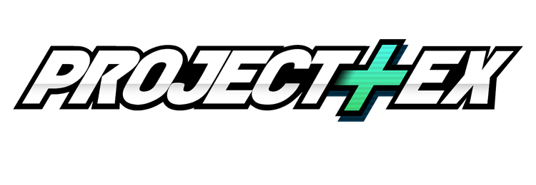
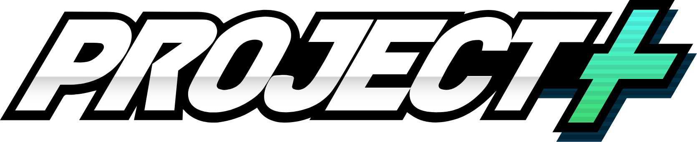
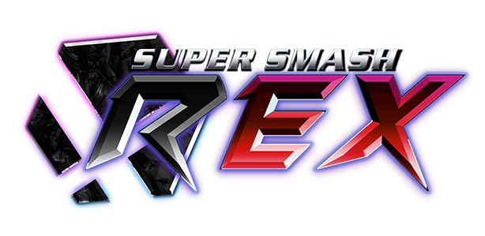
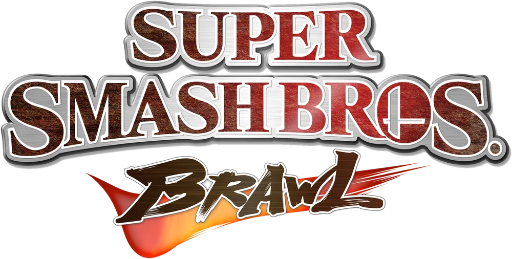
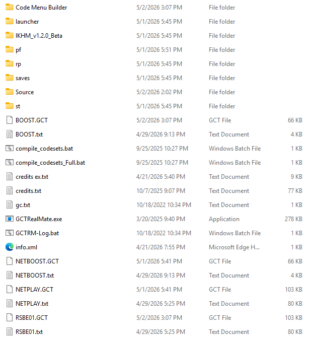

# Getting Started

This section will go over how to get started modding Brawl for those with little-to-no experience.

## Starter Builds

To get started modding Brawl, the first thing you need to do is decide what kind of **build** you want to use as a base for your mods. In most games, everyone is working with a similar baseline - the vanilla game. However, over the years, the Brawl modding scene has grown and shifted tremendously, resulting in numerous different builds with their own goals, features, characters, and gameplay. As such, unless you want to reinvent the wheel, it's a good idea to pick a build that aligns closely to your own goals and start with that.

It is possible to start completely from scratch, adding features to vanilla Brawl one-by-one, but that is out of scope for this section.

Below, some good, popular builds to use as a base are listed. Note that this list is not at all comprehensive, nor is it intended to be, so if you don't see a build you recognize here, it's not personal. This is simply meant to list the best starting points for newcomers to get modding.

Most builds have a Wii and Dolphin version, depending on whether you are playing on console or an emulator.

### P+Ex

[P+Ex](https://kingjigglypuff.github.io/) is build that attempts to integrate the BrawlEx engine into Project+. It is designed specifically with a goal of being a good baseline for customization. It features all of Project+'s features and gameplay and some new characters. This build allows up to 128 characters with 50 costumes each. Use this build if you're looking for a good baseline for customizing.

### Project+

[Project+](https://projectplusgame.com/) is a successor to Project M that expands upon the baseline that Project M created. Unlike other builds listed here, it does not use the BrawlEx engine, meaning you cannot add new characters to it through conventional methods. However, it does allow up to 50 costumes per character. Use this build specifically if you want to play Project+ and don't intend to add new characters.

### REX

[REX](https://www.rexbuild.site/) is a build with tons of content already installed for you to enjoy. A successor to PMEX REMIX, REX features tons of added characters, stages, and music, already in-place for you to enjoy. REX is built partially atop P+Ex, so it features the BrawlEx engine. It allows up to 242 characters (more than P+Ex) with 50 costumes each, and also expands the memory limit for fighters, allowing for more complex characters. Use this build if you want something with a lot of cool content already installed, if you want even more than 128 characters, or if you want the expanded fighters that only work with REX's expanded memory.

### KJP's vBrawl Build

[KJP's vBrawl build](https://drive.google.com/file/d/1sNiVAk2UwAVTXFbjwx4ee0eCyUfp4Bfv/view) is an as-of-yet unnamed build that adds the BrawlEx engine and other modern quality-of-life features to vanilla Brawl. Though it is a bit outdated in terms of features compared to the other builds listed here, unlike those builds, it features vanilla Brawl gameplay, and it does have most of the quality-of-life features you might need to make modding easier. It does also still allow up to 128 characters with 50 costumes each. Use this build if you want a vanilla-like experience with some added customization.

?> If you're using this build, you may want to also grab some pre-configured ex configs and portraits for it located [here](https://www.mediafire.com/file/d1hhvtqygz4q7ao/BrawlBuild-ExConfigs.zip/file). The build normally loads these from the Brawl disk, but for modding, it is convenient to have these files on the SD card. You can simply extract the zip file and drop the folder onto your build and replace files when prompted to set this up.

?> This build is considered a work-in-progress and may have some incomplete features or issues. The build is not actively supported either, so keep this in mind when choosing this build.

## Build Setup

So you've picked a build, and hopefully you've gotten it up-and-running to at least test it out. Now, you're interested in actually modifying the build. This section will help you begin to understand how to do that.

If you're a Wii user, your build is installed to a physical SD card. You can insert this SD card into your computer through whatever method works best for you and view the contents that way. If that's the case for you, skip to the [Understanding the Filesystem](#Understanding-the-Filesystem) section. If you're on Dolphin, however, you'll need to understand how to work with the sd.raw included with your build.

### Dolphin Modding: The Virtual SD Card

If you are working with a Dolphin build, somewhere in your build is a `.raw` file, most likely named `sd.raw`. This is a virtual SD card and contains the actual contents of the build. You'll need to understand how to work with the contents of this file to mod anything.

There are a number of setups you can use to work with virtual SD cards. Some of these involve copying your build to your computer and "syncing" it to the sd.raw using a tool (VSDSync or Dolphin itself). Other methods involve mounting the sd.raw so it shows up like a physical drive on your computer and modifying the contents that way. Below are some detailed guides on how to work with these virtual SD cards.

- [VSDSync Quick Start Guide](https://docs.google.com/document/d/10keWiKXYbMt1euIHl99hPukUFDKauqr3Ondf_sW_jgc/edit?tab=t.0#heading=h.u503cymw2sc2) by Meta - A guide to use VSDSync. VSDSync lets you modify files on your PC directly and then run an `.exe` file to sync them to your sd.raw. Unlike other tools, VSDSync only syncs files you modify, making it the fastest way to get changes applied to your build. Recommended if you intend to make many changes.

- [Virtual SD Card Guide](https://dolphin-emu.org/docs/guides/virtual-sd-card-guide/) by the Dolphin team - A guide that covers various methods for editing virtual SD cards, but primarily explains how to use Dolphin's built-in tools to make changes to a virtual SD. It works similarly to VSDSync, allowing you to modify files on your PC and then click a button to generate a new virtual SD card with your changes. Unlike VSDSync, it generates a whole new virtual SD every time, making it a bit slower than VSDSync. However, it is very reliable, and doesn't require any additional tools beyond Dolphin itself.

- [Adding Mods to Dolphin P+/PM builds using imDisk](https://docs.google.com/document/d/1CitPCBgUl5jcqhT9TmwGE0C7FiM3aS_eo2eqVm97mI0/edit?tab=t.0#heading=h.sz9f5q26ljw3) by extreme - A guide to use ImDisk. ImDisk allows you to mount your sd.raw so it appears like another drive on your PC, so you can make changes to the contents directly. Recommended if you want to make small, quick changes here and there, but it is a bit more cumbersome to mount and unmount the drive every time you wish to make a change.

### Understanding the Filesystem

Once you've figured out how to view the contents of your SD card, you can begin poking around the filesystem of your build. Every build should have a main folder at the root of the SD card, named differently depending on the build. Some examples of this main folder are `P+Ex`, `Project+`, `ex_remix`, and `rex_`. If you're using [KJP's vBrawl Build](#kjps-vbrawl-build), you'll have to drill down a little deeper to `private/wii/app/rsbe`.

Inside the main folder is where most of the relevant files for your build are. Most of the game's assets are located within the `pf` folder in here. Custom codes can usually be found in the `Source` folder. In [KJP's vBrawl Build](#kjps-vbrawl-build), you'll actually find custom codes in the `codes/Source` folder at the root of the SD.

_An example of what the filesystem might look like._

Different mods are installed in different parts of the filesystem. Mods and tools should have their own documentation on where you need to navigate to install them.

### Conclusion

Now that you have your environment set up, you can get started on doing basic modding tasks. If you're trying to download and install mods, you should check out the various sites in the [Installing Mods](installing-mods.md) page. If you have mods that require more manual installation, or you just want to get started editing Brawl's files, make sure you have [BrawlCrate](tools?id=brawlcrate). If you're interested in learning about modding generally, check out the other sections on this site.