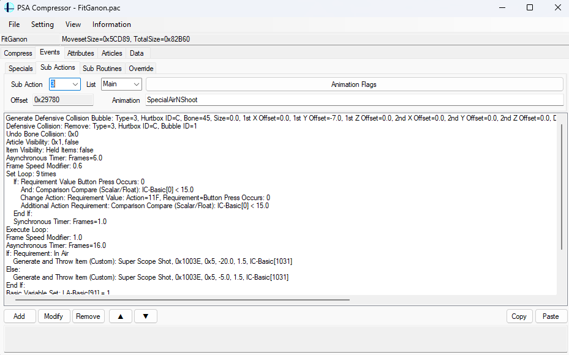

# Movesets

This section goes over some of the essentials to understand modding movesets.

---

## PSA

**PSA** is the colloquial term for the primary way modders work with fighter movesets. Named after "Project Smash Attacks", the original program that was used for editing fighter movesets in the modding scene, today the term PSA is essentially shorthand for editing the fighter moveset data that is contained in the fighter's PAC file. In reality, this data is actually officially referred to as "AnimCmd", but the community generally uses the term PSA.

PSA is a sort of pseudo-coded scripting language. When working with PSA, you are generally selecting fighter animations (referred to as "Motion" in game code and "Sub Actions" in PSA software) and adding "events" that trigger when those animations play.

_Example of some PSA scripting._

#### PSA Resources
- [PSACompressor](tools?id=psacompressor) - The primary tool for editing fighter PSA.

#### PSA Guides
- [PSA Coding Guide](https://gamebanana.com/mods/533181) by Montimers - A series of PDFs explaining PSA coding at a high level, this is the best starting point for learning PSA.

## Modules

Like most things in Brawl, fighters also have code stored in their [modules](coding?id=modules). While PSA controls the high-level functionality of the fighter linked to their animations, modules dictate what functionality is available for the fighter to use in PSA.