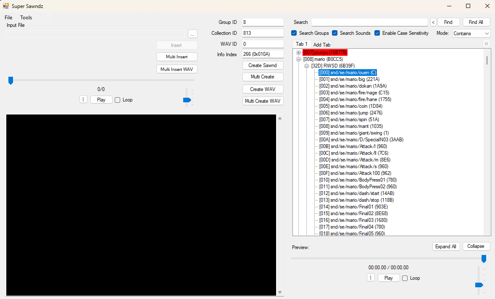
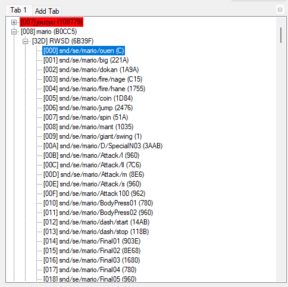
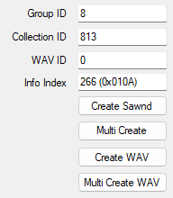

# Soundbanks

Sound effects in Brawl live in **soundbanks**, files that group related sound effects together and are individually loaded when the game needs them. When a soundbank is loaded, any entity in the game can call on a sound effect contained within that soundbank.

## BRSAR

In the vanilla game, all soundbanks are contained within a large **BRSAR** file called `smashbros_sound.brsar` and located in the `sound` folder at the root of the disk. This file contains the various banks as well as headers for them. When modifying the vanilla game, you need to open this BRSAR file using [Super Sawndz](tools?id=super-sawndz), and from there you can modify the sounds within, replacing them with your own sounds.

If you don't have the BRSAR, you can get it by [extracting Brawl's files](extracting-brawl-files.md) from the disk.

### SFX Info

You can view sound effects by opening the BRSAR in Super Sawndz.

When you have a BRSAR open in Super Sawndz, there will be a list of soundbanks on the right-hand pane. You can expand any soundbank to select sounds within.

_An example of a soundbank open in Super Sawndz, with a sound selected._

When a sound is selected, various information about that sound will populate on the left side.

_Soundbank info in Super Sawndz._

Every sound has the following elements:

- **Group ID** - The group ID of the soundbank containing the sound.
- **Collection ID** - The collection within the soundbank that the sound is contained in. Some soundbanks have multiple collections - for example, fighter banks separate voices and other sound effects into their own collections.
- **WAVE ID** - The index of the sound within the collection, zero-indexed.
- **Info Index** - The ID of the specific sound, colloquially referred to as the **SFX ID**.

### Replacing SFX

With a BRSAR open in Super Sawndz, you can replace sounds with new ones. To do so, select any sound in the bank you wish to change. Then, on the left-hand side, there is an **Input File** field with a `...` button next to it. Clicking this button allows you to select a sound file in one of a variety of formats. Once you've selected the file, you can click the **Insert** button to replace the sound you've selected with your chosen file.

### Exporting SFX

You can also export a sound from the BRSAR. Simply select the sound and click the **Create WAV** button underneath the sound info. This will prompt you to save the sound to a file of your choosing.

## SAWND Files

!> This section is only relevant if your build uses the Replacement Soundbank Engine

Most modern builds use a Replacement Soundbank Engine (RSBE). This system makes it so that soundbanks can each be stored as individual files instead of being stored in one large BRSAR file. These files are `.sawnd` files, and are usually located in `pf/sfx`.

SAWND files correspond directly to a soundbank. You can modify them in Super Sawndz, but they require you to first open `smashbros_sound.brsar` in the program. After opening them, you can use the **Input File** field to select a sawnd file and then click **Insert**. This will automatically replace the matching soundbank within the BRSAR with your sawnd file. You can then edit it in Super Sawndz like normal. Once your edits are done, you can export the sawnd using the **Create Sawnd** button underneath the sound info, saving it to a location of your choosing.

### SAWND Naming

SAWND files are named differently depending on the build. Older builds use the **Group ID** in a decimal format, while newer builds use the **Info Index** in hexadecimal format. Both of these match up with the sound info that is displayed in Super Sawndz if you select the soundbank.

# Resources

#### Soundbank Resources

- [Soundbank IDs](data/soundbank-ids.md) - A list of soundbank IDs.
- [JOJI's site](http://ssbbhack.web.fc2.com/index.html) - Contains useful lists of soundbank and SFX IDs, including soundbank IDs custom soundbanks as part of the soundbank expansion system.