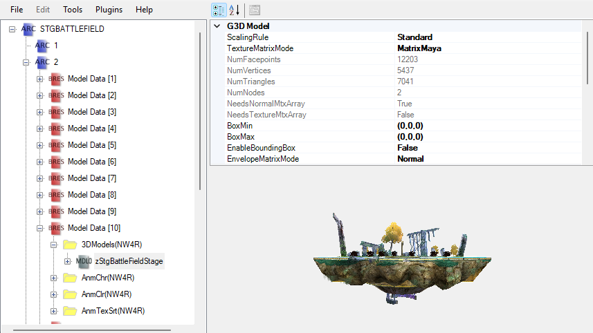
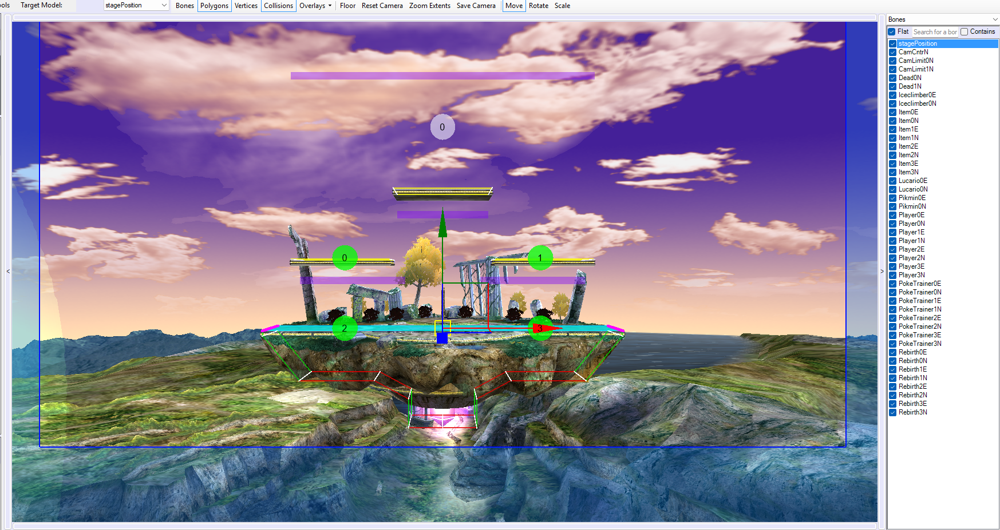
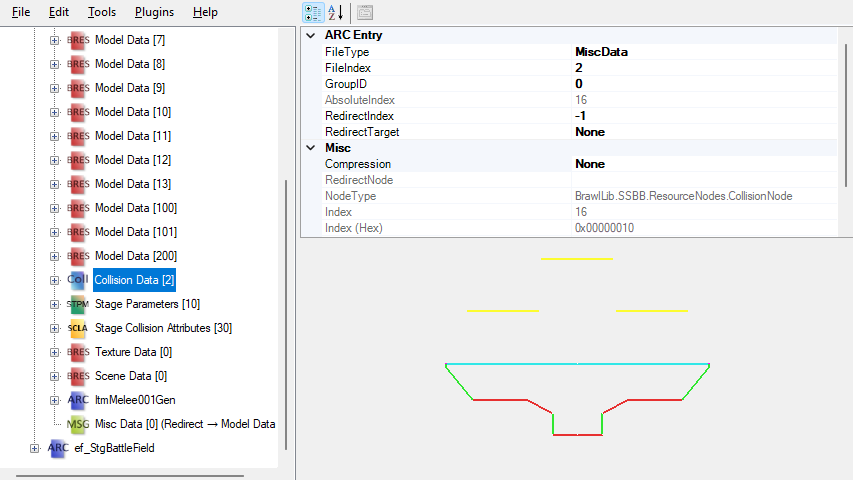

# Stage PAC Files

The main component that makes up a stage is its **PAC file**. Every stage has a PAC file associated with it. The PAC file contains all of the models, animations, and graphics you see in the stage while you're playing it, and in some cases can also dictate some of the stage's behavior.

In most stage PAC files, the majority of the relevant content is located in the `2` archive. This section will go over a few of the important components of a stage PAC file, but it is not comprehensive.

## Models, Animations, and Textures

The stages models are located in **Model Data** archives throughout the `2` archive. Each Model Data archive can (typically) have any number of models in it, but generally, only one animation in each Model Data will play at a given time. As such, if you want multiple different animations playing at once, you probably need to split them throughout different Model Datas.

Which Model Datas will be loaded for the stage is determined entirely by the stage [module](coding?id=modules). If you're unsure which Model Datas work for your stage, you should check what the original stage that your stage's module is based upon uses - those Model Datas should work for your custom stage as well. If you need different Model Datas, you can use a different module or create a custom one.

Generally, Model Data [100] contains a stagePosition (or similarly named) model which controls some of the basic positioning of elements in your stage. The bones of this model control things like camera limits, death and respawn positions, item spawn positions, and more.

Model Data [101] is generally used for the placement of Pokemon Trainer.

Textures for a stage are usually all placed within a single `Texture Data` archive in the PAC file.

## Collision Data

Every stage has collision data, which controls the stage's collision behavior with fighters, items, etc. Some stages might have more than one collision data.

## Effect Bank

Some stages have an effect bank. This effect bank is usually named something like `ef_StgBattlefield`, where `Battlefield` is the name of the stage. This is not always accurate, however. The effect bank is at the root of the PAC file in it's own archive.

---

#### Stage PAC Guides
- [Brawl/PM Stage Modding Tutorial](https://www.youtube.com/watch?v=COikXif5cQ4) by Electropolitan - A detailed video guide on how to create your own stage, this video focuses on how to construct the stage mostly within the PAC file.