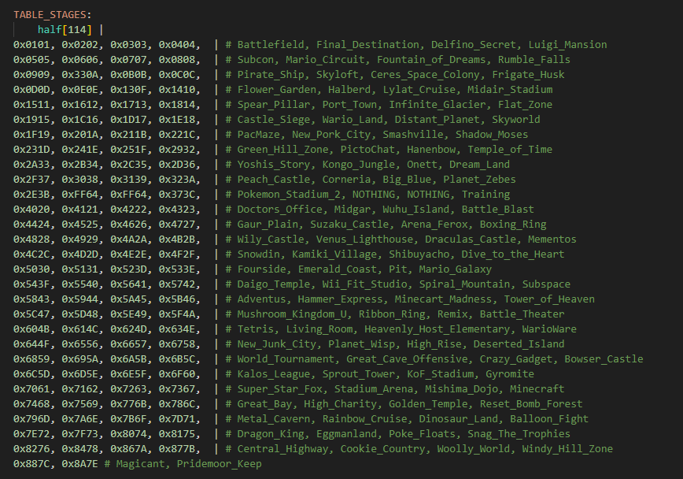
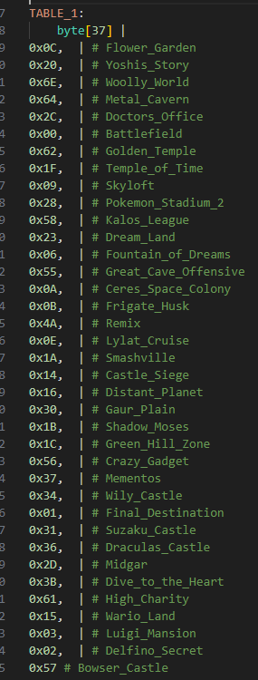
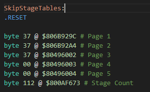
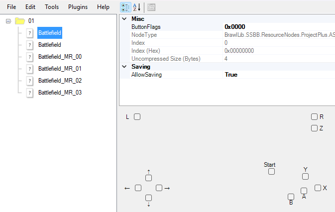
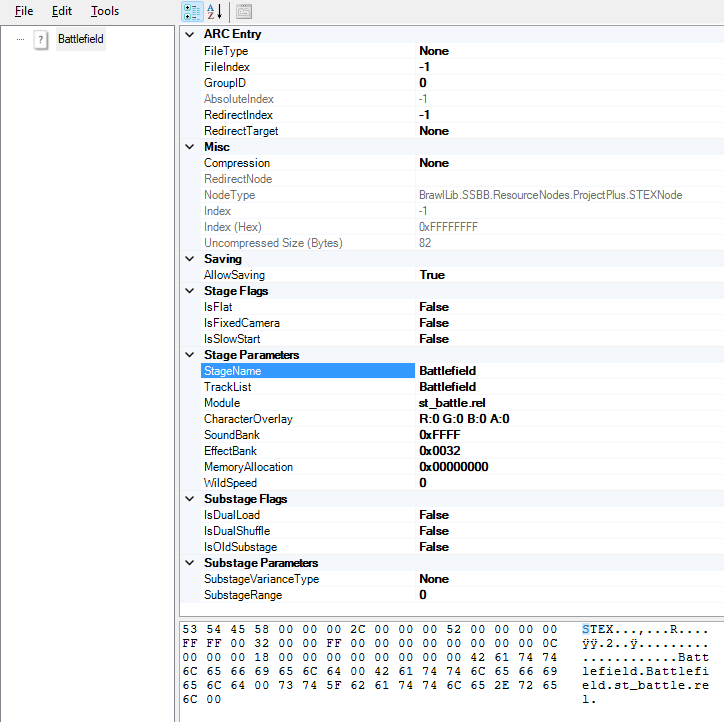
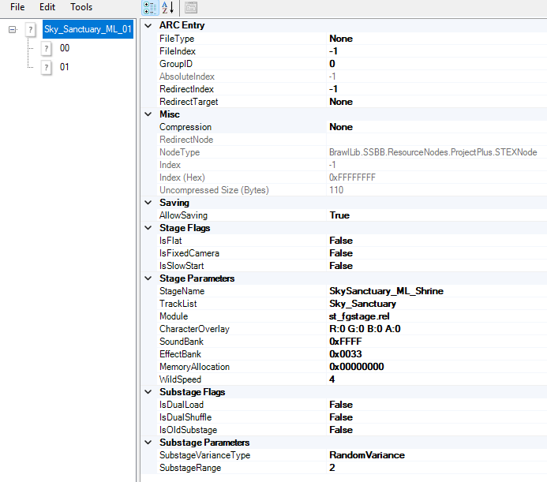
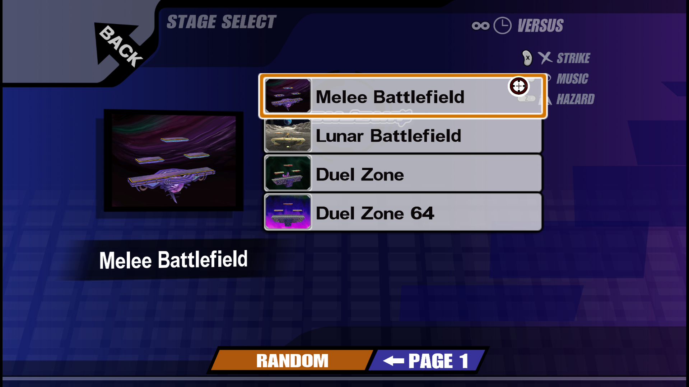
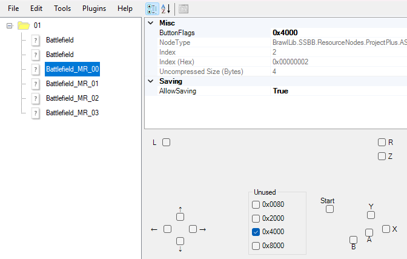
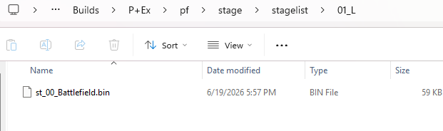

# Stage Slots

Every stage exists within a stage **slot**. If you're using vanilla Brawl, these stage slots and their IDs are hardcoded for each stage. If you're using a custom build with the [Stage File System](stageexpansion.md), these slots are determined either by an ASM table or a custom `RSS` file.

Stage slots are essentially made up of a couple of IDs. The **stage ID** is used to identify the stage throughout the game's code. The **cosmetic ID** is used to identify which cosmetics are associated with the stage.

## Stage Table

!> Requires the Stage File System!

If you're using vanilla Brawl, stage slots and their IDs are hardcoded, so there isn't anything you can do to change them. However, if you're using a custom build with the Stage File System, which stages are available is controlled by a **stage table**. The stage table lists all of the stage IDs and their corresponding cosmetic IDs. Where the stage table is stored depends on the build.

### ASM Stage Table

If your build is on an older version of the Stage File System, your stage table is most likely located in an ASM file, usually named `StageTable.asm` in `Source/Project+`. It's usually labeled `TABLE_STAGES` within this file.

_An example of what a customized stage table might look like in a build._

Each entry in this table is in the format `0xXXYY`, where `XX` is the stage ID in hexadecimal format, and `YY` is the stage's cosmetic ID in hex. You can add new stage slots to the table by adding a new entry where both IDs are unique. If you do so, you also need to increase the size of the table by changing the `half[114]` code at the top to a different number matching the number of entries in your table.

#### Stage List

Adding a stage to the table will not make it immediately usable in-game - you'll still need to make it appear on your stage select screen.

Above the stage table you will generally see a few other tables. Typically, each of these tables represents one page of the stage list.

_An example of a single page of the stage list in StageTable.asm._

Each of the entries on a page aligns with an entry in your table, by index, starting at 0. For example, in the stage table, if your "Battlefield" stage (0x0101) is the _first_ entry in your stage table, then to add it to your page you would add an entry with a value of `0x00`.

Like the stage table, when you add a new stage to a page, you need to expand the count of that page by modifying the `byte[37]` line so the number in it matches the number of entries on your page. In addition, however, you must also modify another snippet of code. Usually located at the bottom of `StageTable.asm`, you will see a few lines setting sizes for pages and a stage count.

When you add a stage to a page, you need to expand the number associated with that page. For example, in the above image, if I add a stage to page 1, I need to change the line labeled `# Page 1` so that it starts with `byte 38` instead of `byte 37`. Additionally, you need to modify the overall stage count by changing the line labeled `# Stage Count`. In the above example, I would do so by changing `byte 112` to `byte 113`.

### RSS Stage Table

If your build is on the latest version of the Stage File System, your stage table is instead stored in `RSS` files in your build. These files are located in `pf/stage/switch` generally, and end in a `.rss` extension. Each of these files represents a different stage list preset which you can switch between on the random stage switch submenu in the rules menu in-game. Each RSS file has its own table which will be used when that preset is loaded.

BrawlCrate does not currently support RSS files. As such, if you want to modify what stages are in your table, you must use [BrawlInstaller](tools?id=brawlinstaller).

## ASL Files

!> Requires the Stage File System!

If your build uses the Stage File System, then your build implements customizable `.asl` files that are used to determine what stage [params](#param-files) to use when certain buttons are pressed. ASL files are found in `pf/stage/stageslot` in most builds. The name of each ASL file lines up with the **stage ID** in your stage table. For example, if I wanted to open the ASL file for Battlefield (ID 0x01), I would open `01.asl`.

Entries in the ASL file correspond to param files (see next section) in your build. When you add an entry to the ASL file, it should be named to match an existing param. For example, if I want an entry in my ASL file to load my `Battlefield.param`, I would name the entry `Battlefield`.

When you select a stage, an entry in the ASL file is chosen based on the buttons you are holding in-game. The selected entry's param will then be loaded. Which entry is associated with which buttons is determined by the **ButtonFlags** field in the entry.

The easiest way to edit these button flags is using the checkboxes displayed below - each of these corresponds to a button. For example, if you check the `L` box, the ASL entry will only be selected if you choose the stage while holding the L-button in-game. You can also select multiple buttons, making it so a combination is required to pick the stage.

If an entry has no buttons set, it will be used if the player selects the stage without holding any buttons.

## Param Files

!> Requires the Stage File System!

If your build uses the Stage File System, then instead of stage details (such as PACs and modules) being hardcoded, they are controlled with customizable `.param` files. These files can be found in `pf/stage/stageinfo`, and are generally named after the stage.

Param files can be edited in BrawlCrate. Here is a quick overview of what the fields within a param do:
- **IsFlat** - If true, makes fighters render as flat 2D planes while playing on the stage, similar to the Flat Zone stages.
- **IsFixedCamera** - If true, the camera will remain in a fixed position at all times and will not move.
- **IsSlowStart** - If true, the stage will be slowed down during the match start countdown.
- **StageName** - The name used for the stage's PAC file, prepended with `STG`. For example, if this field is `Battlefield`, then when this param is selected, `STGBATTLEFIELD.pac` will load.
- **TrackList** - The name of the [tracklist](music?id=tracklists) to load for this stage. For example, if this field is `Battlefield`, then when is param is selected, songs from `Battlefield.tlst` will play.
- **Module** - The module to load for this stage. This is the full filename of the module - for example, `st_battle.rel`.
- **CharacterOverlay** - An RGB color to be overlayed over all characters when the stage is played.
- **SoundBank** - The [soundbank](soundbanks.md) to load when the stage is played. This is the soundbank InfoIndex.
- **EffectBank** - The ID of the [effect bank](effectbanks.md) the stage uses. This must match up with the effect bank name in the PAC file.
- **MemoryAllocation** - The amount of extra memory to allocate for the stage module to use. Whatever number is entered here will be subtracted from the stage's memory pool and made accessible for the module to load resources in the `StageResource` heap. Generally only used when you have custom module behavior.
- **WildSpeed** - Stage speed modifier when "Wild Mode" is enabled in builds that have it.

### Stage Soundbank Variants

Stage soundbanks can actually be named slightly differently from regular soundbanks - you can add `_` followed by the param to the soundbank name to make it so different params load different soundbanks. For example, if you wanted a custom param called `Battlefield_ML_01` to load it's own soundbank with ID `0x51`, you would create a `sawnd` file named `051_Battlefield_ML_01.sawnd`.

If no soundbank is found with a name matching your specific param, the original soundbank would be used instead. For example, in the aforementioned scenario, if you did not have a `051_Battlefield_ML_01.sawnd`, the stage would instead load `051.sawnd`.

### Substages

Param files also allow you to add **substages**. Substages allow you to load different PAC files based on certain criteria when your stage is selected, rather than loading one fixed PAC file. For example, you can use substages to set up a stage that randomly selects between a couple different PAC files, and stages like Castle Siege use it for their stage transformation functionality.

Substages only load different PAC files - everything else about the stage is derived from the param.

To add a substage, you just add a child node to the base param node (right-click -> *Add New Entry* in BrawlCrate). 

*In this example, the param Sky_Sanctuary_ML_01 has two substages added to it, 00 and 01.*

#### Substage PAC Files

Each substage node represents a substage which will load a different PAC file when selected through any of the methods outlined in this section. The name of the PAC file is based on both the StageName field in the param and the name of the substage node. For example, if you use a param with the StageName set to "Battlefield", and it has a substage node named "00", the PAC file that substage will load will be STGBATTLEFIELD_00.pac.

#### SubstageRange

The **SubstageRange** in the param file determines which of the substage nodes can be selected when the stage is selected. If set to 0, no substages can be selected. If set to 1, the first substage will be available for selection when the stage loads. If set to 2, the first and second will be available. Usually, you want this to match the number of substages you have, but you could choose to make it smaller than the list of substages if preferred.

#### SubstageVarianceType

The **SubstageVarianceType** in the param file determines how you substages are selected when your stage is selected. It has the following options:

- **Normal** - Unknown
- **RandomVariance** - When the stage is selected, a substage will be chosen at random from the list of available substages
- **SequentialTransform** - Not yet implemented
- **RandomTransform** - Not yet implemented
- **TimeBasedVariance** - Used to have substages be determined by time-of-day, like Smashville
- **None** - Substages will not be used

#### Other Properties

There are a few other properties in the param file relevant to substages. They are as follows:

- **IsDualLoad** - Used by Castle Siege. If true, the substage PAC file will be loaded alongside the main PAC file.
- **IsDualShuffle** - Used by Lylat Cruise. If true, a randomly chosen substage PAC file will be loaded alongside the main PAC file.
- **IsOldSubstage** - Unknown

## List Alts

!> Requires the latest Stage File System!

With the latest Stage File System, you have the ability to add **list alts** to any stage. These alts are accessible by pressing **L+Start** or **R+Start** while hovering over the actual stage icon on the stage select screen (SSS). This functionality only works if you actually set up list alts for the stage.

List alts are a good way to add even more alts to your stage beyond alts accessed with special button presses. It is scalable and allows an effectively endless number of alts per stage.

_The menu shown when you press R+Start on a custom stage with list alts set up._

### ASL Entries

If you want to add a list alt for your stage, the first thing you must do is add an entry to the [ASL file](#asl-files). This is added the same way as other ASL entries, but the **ButtonFlags** field is set differently. 

The ButtonFlags value starts at `0x4000` for alts that should display when **R+Start** is pressed and `0x8000` for alts that should display when **L+Start** is pressed. Then, you should add a number equal to the index the alt will display at in the list, zero-indexed. So, if this is the first alt in your L+Start list, it would be `0x8000`, because the first item in the list has an index of 0. If it was the second item in your L+Start list, it would be `0x8001` instead.

_A basic list alt setup. In this example, the highlighted entry is the first list alt to display._

Just like any other ASL entry, the name of the entry determines what param will be loaded when the alt is selected.

### Bin File Setup

In addition to setting up the list alt, you need to add a bin file to your build. You can create a copy of [this sample file](https://www.mediafire.com/file/4dfsa4khg9rr826/st_00_sample.bin/file) to use, or alternatively you can use any bin file created with the Stage Builder in-game or use any bin file from [Project+](getting-started?id=project).

Bin files are generally located in `pf/stage/stagelist`. The folders in this directory align to the stage's ASL slot ID, appended with `_L` for L+Start alts, and `_R` for R+Start alts. For example, a Battlefield stage with an ID of `0x01` would have it's L+Start list alts located at `pf/stage/stagelist/01_L`.

Any bin files in one of these folders will be displayed in the list when L+Start or R+Start are pressed on the stage. The stages are presented based on their _alphabetical order_ in the operating system, which means if you don't name your files correctly, they could be displayed out of order. As such, it's recommended to name them in a format of `st_XX_AltName`, where `XX` is the index (zero-indexed) of the alt in the list, and `AltName` is an arbitrary name you'd like to place on the bin file. Note that bin file names cannot be longer than 18 characters or the stage will not be displayed.

Note that at this time, BrawlCrate cannot modify these bin files. To change the thumbnail and name that is displayed on your stage in the list, use [BrawlInstaller](tools?id=brawlinstaller). BrawlInstaller will also handle saving the bin files in the correct place for you automatically, so you don't need to do these steps manually.

---

# Resources

#### Stage Slot Resources

- [Sample Bin File](https://www.mediafire.com/file/4dfsa4khg9rr826/st_00_sample.bin/file) - A sample bin file to use for setting up list alts if your build supports them.

#### Stage Slot Guides

- [Project+ stage managing guide](https://docs.google.com/document/d/19TnQceFG2_9NQJ1Dyz3JCWLVBrKePcgBoiDW0pgW8qA/edit?tab=t.0) by mawwwk - A guide on how to set up stages manually.